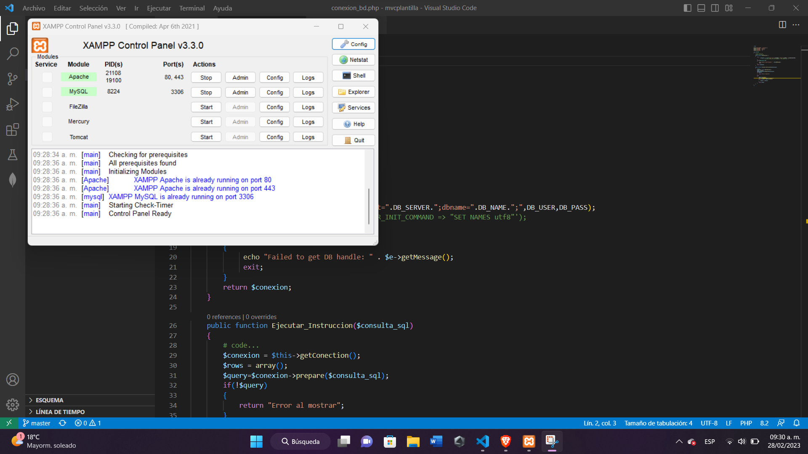
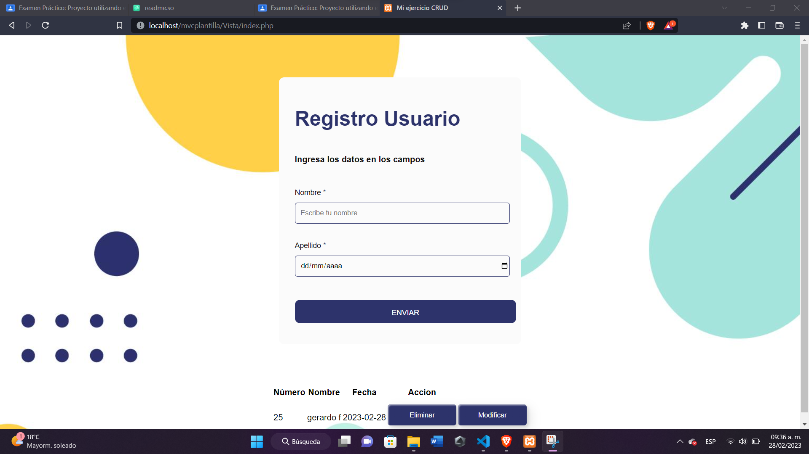
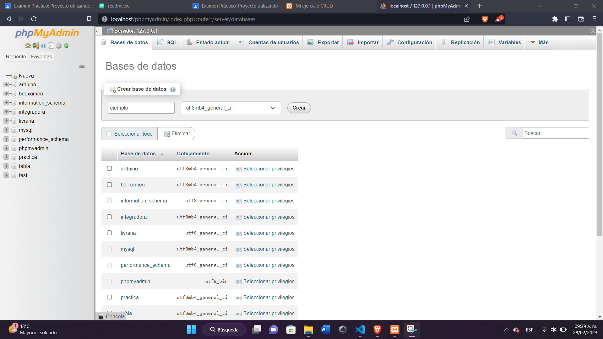
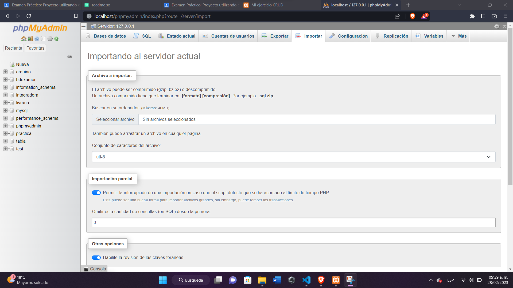

# Arquitectura de software MVC (Modelo, vista y controlador)
Este documento es un manual para utilizar el software por medio de un patron Modelo Vista Controlador.

## 📌 ¿Porque utilizar MVC?
  * Principalmente es una arquitectura diseñada por expertos.
  * La mayoría de las grandes plataformas la utiliza (con versiones mejoradas).
  * Permite el desarrollo ágil, modular, mantenible y escalable.
  * Facilita el trabajo en equipo.

## 📐 ¿Cómo funciona?
El software funciona de la siguiente manera:

Consta solamente de una interfaz minimalista, en la cual tiene un formulario a llenar con solo 2 datos (Nombre y Fecha), y debajo de ella se encuentra una tabla donde se mostraran los datos registrados, ademas de dos acciones(Modificar y Eliminar). 

El software tiene 3 carpetas organizadas por MVC, en la cual viene comentado cada linea de codigo para un mejor entendimiento.

Dentro de la carpeta "Modelo" se encuentra la conexión de la base de datos MySQL, donde se modificará los datos principales (Nombre del Servidor, Nombre de la BD, Usuario y Contraseña), en caso de no encontrar la linea de codigo se encuentra comentado para tener facilidad.

La carpeta "Controlador" se encuentran las acciones que hará el software, como lo es la inserción de datos, modificar, eliminar o buscar (CRUD).

"Vista" es la carpeta contienen el código de nuestro Software que va a producir la visualización de las interfaces a los usuarios, dentro del codigo viene la estructura de el formulario y Tabla de Datos

## 📌 ¿Cómo instalar este software? 
Puedes descargar el código dentro del repositorio mvc que se encuentra en mi perfil de github:
* ```https://github.com/Gerardo3646/MVC_Examen```

Una vez descargado, necesitarás del servidor local XAMPP, en caso de no contar con ello, a continuacion se anexa el link de descarga:
* ```https://www.apachefriends.org/es/index.html```

Posteriormente, XAMPP crea carpetas locales dentro de tu explorador de archivos, en la cual la ubicación esta dentro de tu disco duro C:>Xampp>htdocs.

Dentro de htdocs puedes anexar el codigo descargado de github para no presentar errores, seguidamente, inicia el servidor XAMPP activando Apache y MySQL.



Por ultimo, dentro de tu navegador ingresa la ubicación de tu software en la URL, por ejemplo:

- "Localhost/mvcplantilla/Vista/index.php"



## 📌 ¿Cómo importar la bd del software?
En la primera captura, se muestra la casilla admin a un lado de MySQL, tendras que dar clic y crear una nueva base de datos.

Despues, entra a esa base de datos y elije la casilla Importar que se encuentra en la parte superior de la interfaz, ahi es donde agregarás la nueva base de datos y aceptaras.
